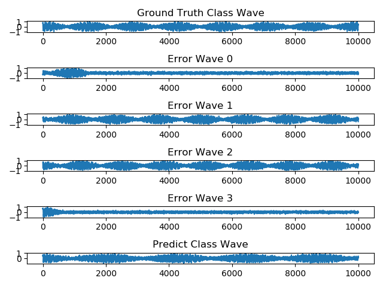

# **Project  Insights**

***

## About  the  Project
Omitted


## Current Achievement

* Collect Data of same_module_same_mac, same_module_diff_mac, diff_module_diff_mac(mini5&43)
* Generate pre-split Train/Test set  for each dataset
* A data processing program including converting csv/txt data to h5 data

* Experiment on each mini5 dataset


##  Discussion

***

## Switch to h5 file

The old code load data from csv/txt, which cost a lot of time to read and convert string data to float32. Now we load data from h5 which data is in the right format and stored continuously, it's proved that this method is far more quicker than csv/txt method.

**H5 On My Laptop**

```
Compute Cost 33.6818323135376s
Read Batch Cost 2.616137742996216s
Compute Cost 12.403181314468384s
Read Batch Cost 2.4905309677124023s
Compute Cost 12.3427894115448s
Read Batch Cost 2.472379684448242s
Compute Cost 12.368764162063599s
Read Batch Cost 2.4715495109558105s
Compute Cost 12.148866415023804s
Read Batch Cost 2.48537015914917s
```

Only 15% time was cost on the reading data.

In another computer, one iteration cost about 55s~60s, which indicates that in csv/txt method, 75% of time was consumed on File I/O.

However, still we hope to find some quicker way to read data, for disk of google platform is not as good as my computer. Comparing to GPU compute time, I/O still tack too much time.

**On GCP**

```
Compute Cost 10.438929080963135s
Read Batch Cost 5.137465715408325s
Compute Cost 0.8668842315673828s
Read Batch Cost 4.9810919761657715s
Compute Cost 0.8627252578735352s
Read Batch Cost 4.955933332443237s
Compute Cost 0.859318733215332s
Read Batch Cost 4.859827518463135s
Compute Cost 0.8686928749084473s
Read Batch Cost 4.979849338531494s
```


***

## Data Processing Speed


Most of processing time was cost on reading csv and writing txt.

By reduce the string length of txt, there is some enhancement at txt writing.

Still, the disk I/O is the limitation of out program, powerful CPU or multiprocessing give no help. Try splitting the data set to several computer.


***

## Test Index

Micro Average Precision(Accuracy)

Macro Average Precision

Macro Average F1 Score (Harmonic average of Recall and Accuracy) 

Using Macro-F1 Score as final test index

Under normal circumstance, difference of this three indexes are minor.


***
## Result of  Diff Module Same Mac on Mini5


Classes' Macro F1 Score
0.9807583625073948

---

Classes' Macro Precision
0.9807583625073948

***

Classes' Micro Precision
0.9807321772639692


The Confusion Matrix gives the which two class the model most easy to mix up. And the peek num gives the frequency shit of each module.

We can find the most easily mixed up module of each module is also the module with most close frequency shift. Now we can imply that the "Analog feature" is most composed of the frequency shift, or peek num.

In some class, like B, G, we can find that the difference between frequency shit is inversely proportional to  probability of model mixing up two classes.

How ever, in 43 module date set, the distribution range won't change, so each module will have more modules with very similar peek num. The accuracy of large dataset may be decline a lot.


***

## Result of  Same Module Diff Mac on Mini5

Still Bad. We use 2048 hidden state, the train accuracy went up to 97%+


However, it's overfitting:


Classes' Recall
[0.59552296 0.58317252 0.61945195 0.68853724 0.57661135]

**************************************
Classes' Precision
[0.61744698 0.55551471 0.58963997 0.7023622  0.60388036]
**************************************
Classes' F1 Score
[0.60628684 0.56900772 0.60417843 0.69538102 0.5899309 ]
**************************************
Classes' Macro F1 Score
0.6137688431414794

**************************************
Classes' Macro Precision
0.6137688431414794
**************************************
Classes' Micro Precision
0.6126592049401776


***

## Quite Tail Problem

### The problem

At the beginning of this project, we are told that the signal we received should be composed with an quite head following beacon signal.


It seems the dataset with 60k samples of the last paper did following this formula: quite head + beacon signal.

Also, I remember the data I get at the beginning of this project with 11k samples also have a quite head because I have written a program to plot the data before and after trunked, and it looked fine.

But now, I look to the date set we have, most of date don't have an quite head, some of them have an quite tail.

So, at some time point, the data we collected become the waveform shown below: no quite head, some have a quite tail:


### Several Hypothesis

The principle of data collection is the receiver triggered by the rising edge of input whose threshold is -35dbm.

If the beacon frame signal magnitude never go less than -35dbm, then the receiver will only be triggered at the beginning of the beacon frame, which will generate a wave with quite head.

Now it seems the receiver is untriggered and retriggered during the beacon frame, so most of raw data don't have a quite head, some have a quite tail.

* We change the trigger threshold some time
* ...

### Influence of this "quite tail"

Samples with quite tail are easily be wrongly classified.

The model we trained has learn how to ignore the quite tail and focus on the signal part, so most of samples with quite tail can still be rightly classified.

* However, the wrong classifications between two module whose frequency shift is large are almost completely caused by these quite tail signal:


* The wrong classifications between two module whose frequency shift is close are partly caused by these quite tail signal:

  

### Remedy

Write a program to kick out the wave:

* Mean power is tow low(for long quite tail signal)

* Power difference between first and last quarter is too large.

We can add this program to training and testing. Or create an new clean dataset.