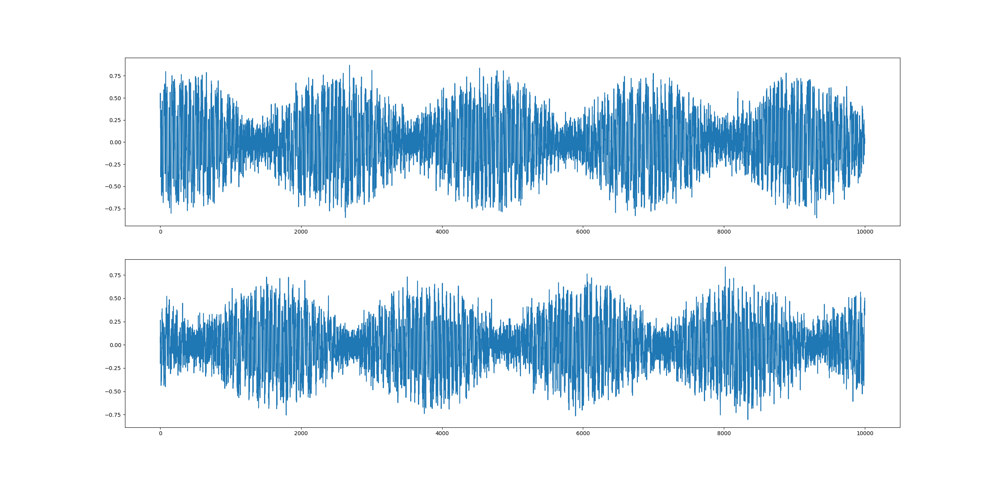
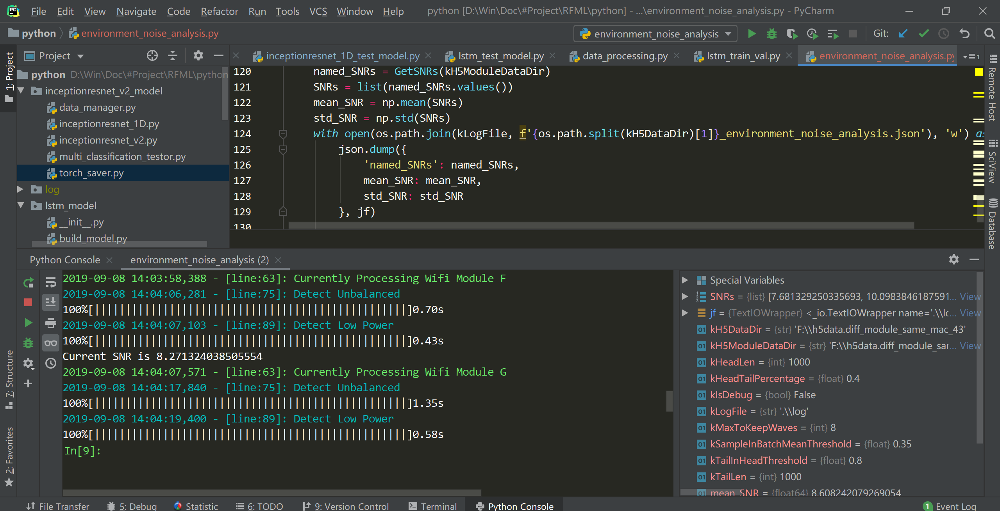
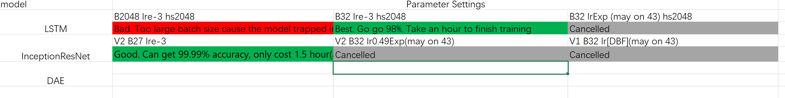

# Radio Fingerprint Machine Learning

> With the increasing popularity of the Internet of Things (IoT), device identification and authentication has
> become a critical security issue. Recently, Radio Frequency (RF) fingerprint-based identification schemes have attracted wide attention as they extract the inherent characteristics of hardware circuits which is very hard to forge.

 In this research project, we aim to:

1. Established an very large, properly pre-processed dataset of radio signal frames from 43 different WIFI module. Such huge dataset seems has never showed up in other research.

2. Try to propose several useful machine learning model to extract features from analog radio signal. Sufficient experiment should be implemented for comparison about F1-score, robustness to noise, model size&FLOPs  

### This Project is still Ongoing. Visit Insights.md for current Progress&Discussion😊

